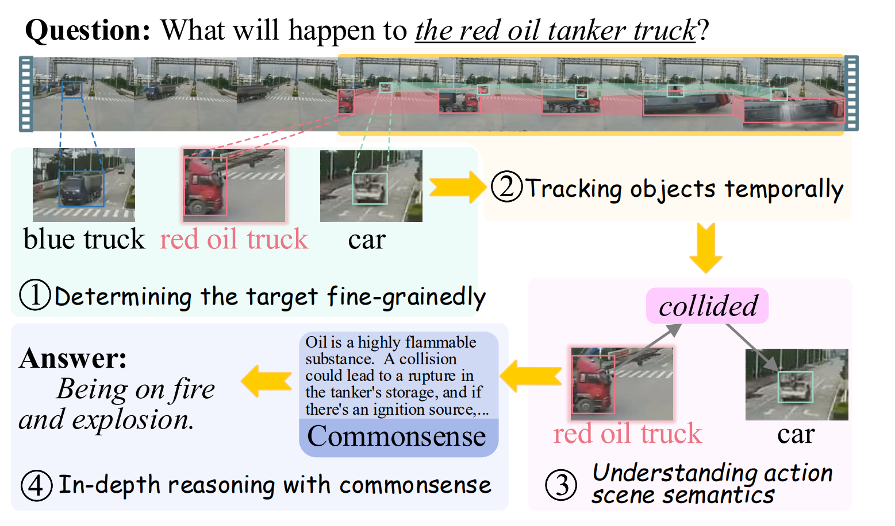
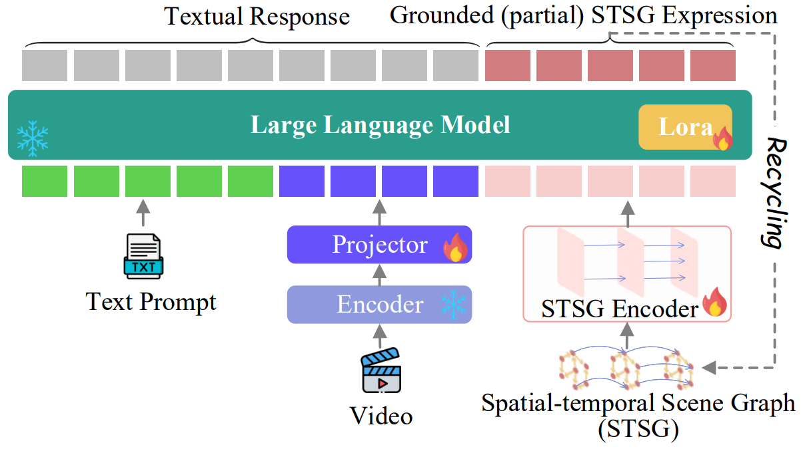

<h1 align="center">
🤔🎞️ Video-of-Thought: Step-by-Step Video Reasoning from Perception to Cognition
</h1>

**ICML (Oral) 2024**

[Hao Fei](http://haofei.vip/), [Shengqiong Wu](https://chocowu.github.io/), [Wei Ji](), [Hanwang Zhang](https://personal.ntu.edu.sg/hanwangzhang/), [Meishan Zhang](https://zhangmeishan.github.io/), [Mong Li Lee](https://www.comp.nus.edu.sg/~leeml/), and [Wynne Hsu](https://www.comp.nus.edu.sg/~whsu/)


<a href='https://haofei.vip/VoT/'></a>
<a href='https://openreview.net/pdf?id=fO31YAyNbI'></a> 
[](https://youtu.be/2fKCWjetV-Y)

<a href="https://pytorch.org" rel="nofollow">
  
</a>


This repository contains the code of ICML 2024 paper [Video-of-Thought](https://is.gd/fcfZeO).

### 🎉 Visit the project page: [VoT](http://haofei.vip/VoT/)

----------

## Abstract
Existing research of video understanding still struggles to achieve in-depth comprehension and reasoning in complex videos, primarily due to the under-exploration of two key bottlenecks: fine-grained spatial-temporal perceptive understanding and cognitive-level video scene comprehension. 
This paper bridges the gap by presenting a novel solution. We first introduce a novel video Multimodal Large Language Model (MLLM), MotionEpic, which achieves fine-grained pixel-level spatial-temporal video grounding by integrating video spatial-temporal scene graph (STSG) representation. 
Building upon MotionEpic, we then develop a Video-ofThought (VoT) reasoning framework. VoT inherits the Chain-of-Thought (CoT) core, breaking down a complex task into simpler and manageable sub-problems, and addressing them step-bystep from a low-level pixel perception to highlevel cognitive interpretation. 
Extensive experiments across various complex video QA benchmarks demonstrate that our overall framework strikingly boosts existing state-of-the-art.

  


## Overview<a name="overview" />

> The first video Chain-of-Thought reasoning framework, VoT, which decomposes raw complex problems into a chain of sub-problems, and reasons through
multiple steps from low to high levels, enabling not only pixel perceptive recognition but also semantic
cognitive understanding of videos.

<p align="center">
  
</p>

> We also introduce a novel video MLLM, namely MotionEpic, which supports not only video input but also the encoding, understanding and generation of STSGs.


<p align="center">
  
</p>


## Method

- MotionEpic: Fine-grained Spatial-temporal Grounded Video MLLM
    - employ the [Vicuna-7B (v1.5)](https://huggingface.co/lmsys/vicuna-7b-v1.5) as the backbone LLM. To perceive video input, 
    - adopt the [ViT-L/14](https://huggingface.co/openai/clip-vit-large-patch14) encoder and Q-Former projector. 
    - design MotionEpic to support the STSG signal, where we
retrofit the Graph Transformer with recurrent propagation to encode the multi-frame STSG information

- Video-of-Thought Reasoning Framework
    - Step-1: Task Definition and Target Identification
    - Step-2: Object Tracking
    - Step-3: Action Analyzing
    - Step-4: Question Answering via Ranking
    - Step-5: Answer Verification


----

## Installation

Please first clone the repo and install the required environment, which can be done by running the following commands:
```
conda env create -n motionepic python=3.8

conda activate motionepic

#### CUDA 12.1
conda install pytorch==2.1.2 torchvision==0.14.1 torchaudio==0.13.1 pytorch-cuda=11.6 -c pytorch -c nvidia

git clone https://github.com/scofield7419/Video-of-Thought.git
cd Video-of-Thought

pip install -r requirements.txt
```

----

## Training
Firstly, you need to prepare the dataset, including [Action Geome](https://github.com/JingweiJ/ActionGenome), [webvid](), [MSR-VTT](), and [ActivityNet](http://activity-net.org/). 
Then, you need to modify the parameter, `DATASET_NAME_LIST` to determine the dataset used for training and fine-tuning.
Next, run the command for training and fine-tuning:
```
#### for alignment learning
bash pretrain.sh

#### for finetuning.
bash fine-tune.sh
```

----

## Inference
We implement CoT-based inference (i.e., VoT), please refer to the [predict.py](predict.py) for details. 
Run the command to obtain the results:
```
python predict.py
```

----

## Citation

If you use this work, please kindly cite:

```
@inproceedings{0001W0ZZLH24,
  author       = {Hao Fei, Shengqiong Wu, Wei Ji, Hanwang Zhang, Meishan Zhang, Mong-Li Lee, Wynne Hsu},
  title        = {Video-of-Thought: Step-by-Step Video Reasoning from Perception to
                  Cognition},
  booktitle    = {Proceeding of the ICML},
  year         = {2024}
} 
```


----

## Acknowledgement
Our code is based on the respective official repositories, [NExT-GPT](next-gpt.github.io), and [graphtransformer](https://github.com/graphdeeplearning/graphtransformer/). We fully thank the authors to release their code.


### License

The code is released under Apache License 2.0 for Noncommercial use only. 


### Contact

For any questions, feel free to contact [Hao Fei](mailto:haofei37@nus.edu.sg).


