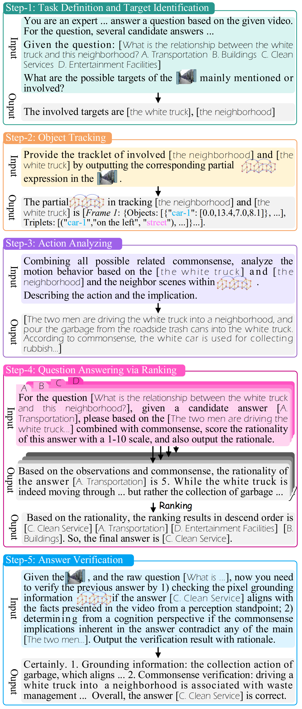

## 🤔🎞️ Video-of-Thought: Step-by-Step Video Reasoning from Perception to Cognition
<a href="https://github.com/scofield7419/Video-of-Thought">
  
</a>
<a href="https://github.com/scofield7419/Video-of-Thought" rel="nofollow">
  
</a>
<a href="https://huggingface.co/docs/transformers/index" rel="nofollow">
  
</a>
<a href="https://pytorch.org" rel="nofollow">
  
</a>


**The implementation of the ICML 2024 paper [Video-of-Thought: Step-by-Step Video Reasoning from Perception to Cognition](http://haofei.vip/downloads/papers/VoT_2024.pdf)**

----------
 ### 🎉 Visit the project page: [VoT](http://haofei.vip/VoT/)

----------


## Overview<a name="overview" />

> The first video Chain-of-Thought reasoning framework, VoT, which decomposes raw complex problems into a chain of sub-problems, and reasons through
multiple steps from low to high levels, enabling not only pixel perceptive recognition but also semantic
cognitive understanding of videos.

<p align="center">
  
</p>

> We also introduce a novel video MLLM, namely MotionEpic, which supports not only video input but also the encoding, understanding and generation of STSGs.


<p align="center">
  
</p>


----------

## Code 

(TBD)


----------

## Citation

If you use this work, please kindly cite:

```
@inproceedings{VoT24Hao,
  author    = {Hao Fei, Shengqiong Wu, Wei Ji, Hanwang Zhang, Meishan Zhang, Mong-Li Lee, Wynne Hsu},
  title     = {Video-of-Thought: Step-by-Step Video Reasoning from Perception to Cognition},
  journal   = {Proceedings of the International Conference on Machine Learning (ICML)},
  year      = {2024},
}
```


----------
### License

The code is released under Apache License 2.0 for Noncommercial use only. 


----------


### Contact

For any questions, feel free to contact [Hao Fei](mailto:haofei37@nus.edu.sg).
